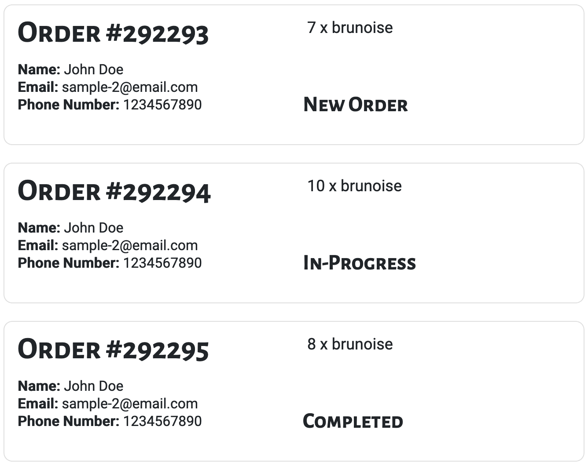

## Usage

This card is used exclusively only on the all orders page of the restaurant dashboard. This is because there are no buttons associated with it.

Files exist under `src\app\components\all-order-card`

## UI Appearance

Notice the various status



## Tag Fields

**Identifier**: `app-all-order-card`

### Input

Specify the input:

| Parameter | Type  | Desc         | Required |
| --------- | ----- | ------------ | -------- |
| `order`   | `any` | Order Object | Yes      |

Currently, the dish object should contain:

```json
{
  "_id": "{{ id from MongoDB }}",
  "user_name": "{{ person name }}",
  "email": "{{ person email }}",
  "phone": "{{ person phone number }}",
  "dishes": "{{ list of objects (each object contains a dish name & count) }}",
  "send_tstmp": "{{ the time stamp for when the order was sent to the restaurant }}",
  "accept_tstmp": "{{ the time stamp for when the order was accepted by the restaurant }}",
  "complete_tstmp": "{{ the time stamp for when the order was completed by the restaurant }}"
}
```

Example:

```json
{
  "id": "1235",
  "user_name": "Jean Doe",
  "email": "sample1@email.com",
  "phone": "4163214567",
  "dishes": [
    {
      "dish_name": "Fancy Dish #1",
      "count": 1
    },
    {
      "dish_name": "Fancy Dish #2",
      "count": 2
    }
  ],
  "send_tstmp": "12:05:21",
  "accept_tstmp": "",
  "complete_tstmp": ""
}
```

Add this to the `.html` file. Replace the sections `{{ }}` with the input to be generated.

```html
<app-all-order-card [order]="{{ order object }}"></app-order-card>
```

### Output

There is no output. The card example above will be generated.
